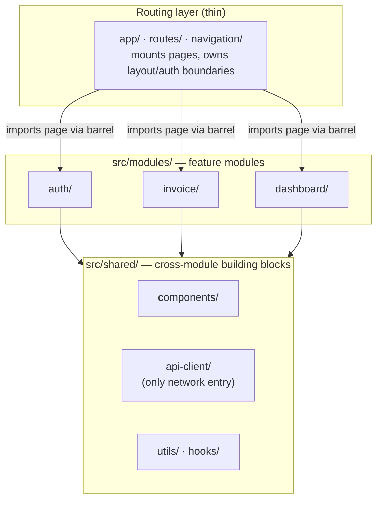
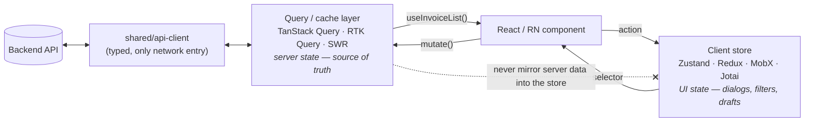
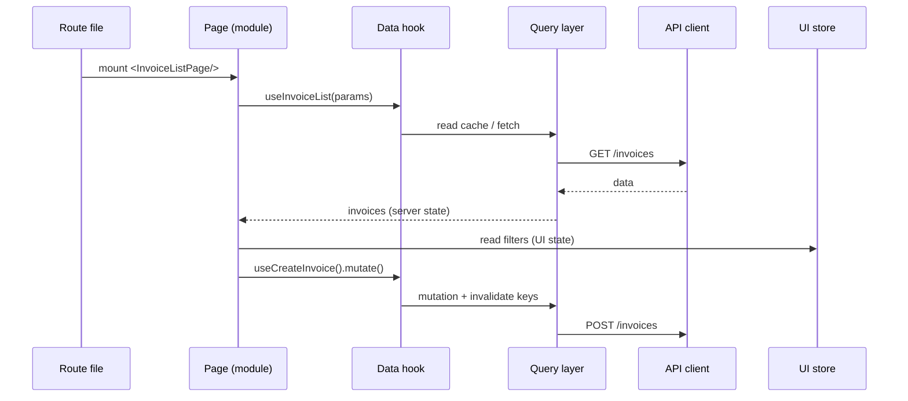
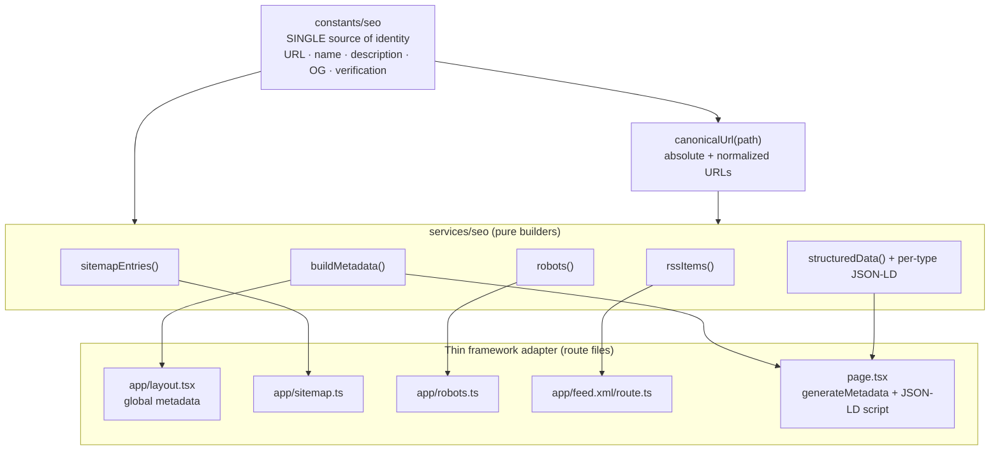
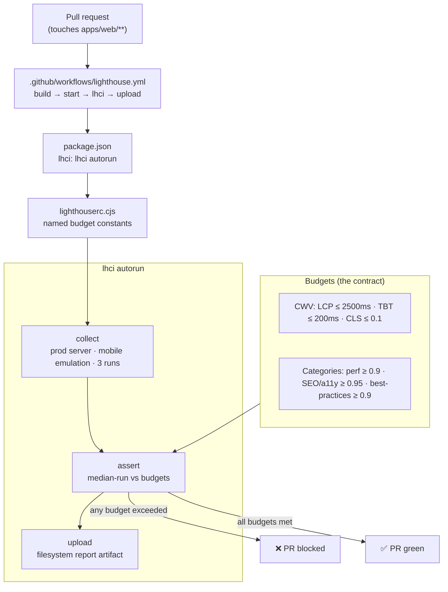

# Frontend Architecture Skill

[](https://skills.sh/stareezy-1/frontend-architecture-skill)

A collection of portable, **framework-agnostic** skills for any React or React Native frontend — packaged as [Agent Skills](https://www.anthropic.com/news/skills) (`SKILL.md`) that Claude Code, Cursor, OpenCode, Codex, Windsurf, and other agents can read and apply.

This repo ships three skills:

- **`frontend-architecture`** — organizes apps into **feature modules** with **page/screen directories**, a strict **server-state vs UI-state split**, **barrel-only** cross-module imports, **co-located styles**, and clear **component-promotion** rules.
- **`frontend-seo`** — a complete **SEO system**: centralized site identity, canonical URLs, per-route metadata (Open Graph + Twitter cards), generated `sitemap.xml` / `robots.txt` / RSS feed, and typed **JSON-LD structured data** (Person, WebSite, BlogPosting, CreativeWork, BreadcrumbList, FAQPage).
- **`frontend-lighthouse`** — a **Lighthouse CI performance gate**: Core Web Vitals budgets (LCP, INP via the TBT lab proxy, CLS) and category score floors enforced as a blocking PR check, with a `lighthouserc.cjs`, an `lhci` script, and a GitHub Actions workflow.

Both share the same design goals:

- ✅ **State-management agnostic** — Zustand, Redux Toolkit, MobX, Jotai, Valtio, or Context.
- ✅ **Styling agnostic** — Tailwind, CSS Modules, Tamagui, React Native StyleSheet, styled-components.
- ✅ **Framework agnostic** — Next.js App Router, React + Vite, Remix, Astro, and Expo / React Native.
- ✅ **Naming conventions** — interfaces prefixed with `I` (e.g. `IFeatureUiState`).

> The skills describe **structure and rules**, not a component library or a visual design. Pair them with a design/component skill for the look-and-feel.

---

## Install

With the [`skills` CLI](https://skills.sh) (works across Claude Code, Cursor, Codex, and more):

```bash
# install just the architecture skill
npx skills add stareezy-1/frontend-architecture-skill --skill "frontend-architecture"

# install just the SEO skill
npx skills add stareezy-1/frontend-architecture-skill --skill "frontend-seo"

# install just the Lighthouse performance-gate skill
npx skills add stareezy-1/frontend-architecture-skill --skill "frontend-lighthouse"

# or install every skill in the repo
npx skills add stareezy-1/frontend-architecture-skill
```

`--skill` (short: `-s`) selects a single skill from the repo; omit it to add all skills. Add `-g` to install globally into `~/` instead of the current project.

Or copy it manually into your agent's skills directory:

```bash
# Claude Code (project scope)
mkdir -p .claude/skills && cp -r skills/frontend-architecture .claude/skills/
cp -r skills/frontend-seo .claude/skills/
cp -r skills/frontend-lighthouse .claude/skills/

# Cursor / others that read .ai/skills
mkdir -p .ai/skills && cp -r skills/frontend-architecture .ai/skills/
cp -r skills/frontend-seo .ai/skills/
cp -r skills/frontend-lighthouse .ai/skills/
```

> Note: `gh skill install` is a preview feature of the GitHub CLI and is not yet available in stable `gh` releases. Use the `npx skills` command above (or manual copy) until it ships.

---

## The `frontend-architecture` skill at a glance

The whole model is five rules applied mechanically. The diagrams below show how they fit together.

### 1. Layered structure — routing is thin, modules hold the app

A route file does almost nothing: it imports a page component from a module barrel and mounts it. All real work lives inside feature modules, which lean on a shared layer.



### 2. Inside a module — the barrel is the only public door

Everything inside a module is private except what its `index.ts` re-exports. Other modules and the router may import **only** from `@/modules/{feature}` — never a deep internal path.

```mermaid
graph TD
    Outside["Other modules / routing layer"] -->|"@/modules/invoice"| Barrel

    subgraph ModuleInvoice["modules/invoice/"]
        Barrel["index.ts<br/>PUBLIC BARREL (the contract)"]
        Pages["pages/&#123;page&#125;/<br/>page.tsx + page.styles.ts + components/ + hooks/"]
        Components["components/<br/>reused by 2+ pages in this module"]
        Hooks["hooks/<br/>query/mutation + key factory"]
        Stores["stores/<br/>UI state only"]
        Services["services/<br/>data access"]
        Types["types/"]

        Barrel --- Pages
        Barrel --- Components
        Barrel --- Hooks
        Barrel --- Stores
        Barrel --- Types
        Pages --> Components
        Pages --> Hooks
        Pages --> Stores
        Hooks --> Services
    end
```



### 3. State is split by origin — and never crosses over

Server data lives in the query/cache layer; UI data lives in the client store. Components read from both but write through hooks — they never `fetch()` directly, and server entities are never copied into the store.



### 4. Component promotion — start local, move outward only when reused

A component is born in the narrowest scope and is promoted one level only when a **second** consumer appears. The same ladder applies to hooks, utils, and constants.

```mermaid
graph LR
    A["Used by ONE page<br/>pages/&#123;page&#125;/components/"]
    B["Used by 2+ pages in a module<br/>modules/&#123;feature&#125;/components/"]
    C["Used by 2+ modules<br/>shared/components/"]
    D["Used by 2+ apps/repos<br/>published package"]

    A -->|"2nd consumer in module"| B
    B -->|"2nd consuming module"| C
    C -->|"2nd consuming app"| D
```



### 5. How a request flows through the layers

Putting it together: a route mounts a page, the page reads server state via a hook and UI state via a selector, mutations go back through the query layer to the API, and styling is referenced from a co-located file.



---

## What's inside

```
skills/
├── frontend-architecture/
│   └── SKILL.md     ← architecture skill (frontmatter + instructions)
├── frontend-seo/
│   └── SKILL.md     ← SEO skill (frontmatter + instructions)
└── frontend-lighthouse/
    └── SKILL.md     ← Lighthouse performance-gate skill (frontmatter + instructions)
```

The **`frontend-architecture`** skill covers:

1. **Five core ideas** — feature modules, page directories, state-by-origin, barrel imports, promotion.
2. **Directory layout** — identical across frameworks.
3. **Feature modules** — the barrel as a contract.
4. **State split** — server (query layer) vs UI (client store), with examples for Zustand / Redux Toolkit / MobX / Jotai.
5. **Co-located styling** — Tailwind / CSS Modules / Tamagui / StyleSheet.
6. **Naming conventions** — `I`-prefixed interfaces and more.
7. **Framework adapters** — Next.js, Vite SPA, Remix, Expo / React Native.
8. **Review checklist** + **component promotion ladder**.

---

## The `frontend-seo` skill at a glance

A complete, framework-agnostic SEO system built as **pure builder functions plus a thin framework adapter**. Site identity lives in one constants module, every URL flows through a single `canonicalUrl()` function, and search engines get a generated sitemap, robots rules, RSS feed, and typed JSON-LD.

### How the pieces fit



The skill covers:

1. **Five core ideas** — one source of identity, absolute canonical URLs, pure builders + thin adapter, typed reusable JSON-LD, content-generated discovery surfaces.
2. **`constants/seo`** — the single source of truth for site identity.
3. **`types/seo`** — typed data models (`RouteDescriptor`, `SitemapEntry`, `RobotsConfig`, `RssItem`, `JsonLd`, …).
4. **Canonical URLs** — one `canonicalUrl()` function used everywhere.
5. **Per-route metadata** — `buildMetadata`, global defaults in the layout, dynamic overrides.
6. **Discovery surfaces** — `sitemap.xml`, `robots.txt`, and an RSS feed generated from content.
7. **Structured data** — typed JSON-LD builders (Person, WebSite, BlogPosting, CreativeWork, BreadcrumbList, FAQPage) cross-referenced by stable `@id`.
8. **Framework adapters** — Next.js, Remix, Astro, Vite SPA, Expo Router (web).
9. **Review checklist** for SEO coverage.

---

## The `frontend-lighthouse` skill at a glance

A **CI performance gate** built around a single `lighthouserc.cjs`. It runs Lighthouse against the production build (median-of-N runs for stability) and **blocks pull requests** that miss Core Web Vitals budgets or category score floors.

### How the pieces fit



The skill covers:

1. **Five core ideas** — one config source of truth, gate the production build, median-of-N stability, Google "good" CWV thresholds, blocking-in-CI with report artifacts.
2. **The config** — `lighthouserc.cjs` with named budget constants and collect/assert/upload sections.
3. **Budget severity & thresholds** — when to use `error` vs `warn`, and the CWV/category targets.
4. **The `lhci` script** — local reproduction of the CI run, mobile and desktop form factors.
5. **The GitHub Actions workflow** — PR-triggered, production-build gate, always-upload reports.
6. **Framework adapters** — Next.js, Remix, Astro, SvelteKit, Vite (server command + ready pattern).
7. **Debugging** — flaky runs, missing INP audit, server-ready timeouts, real regressions.
8. **Review checklist** for the performance gate.

---

## When the agent should use them

**`frontend-architecture`:**

- Scaffolding a new app.
- Adding a feature or module.
- Deciding where a component, hook, or piece of state belongs.
- Naming types and interfaces.
- Reviewing folder structure and import boundaries.

**`frontend-seo`:**

- Adding SEO to a site or wiring metadata into routes.
- Generating `sitemap.xml`, `robots.txt`, or an RSS feed.
- Adding schema.org JSON-LD structured data.
- Fixing canonical-URL or duplicate-content issues.
- Reviewing SEO coverage before release.

**`frontend-lighthouse`:**

- Adding a performance gate / Lighthouse CI to a project.
- Tuning Core Web Vitals budgets or category score thresholds.
- Wiring the Lighthouse GitHub Actions workflow.
- Debugging flaky or failing Lighthouse runs.
- Reviewing performance before release.

---

## License

[MIT](./LICENSE) — use, copy, and adapt freely.
