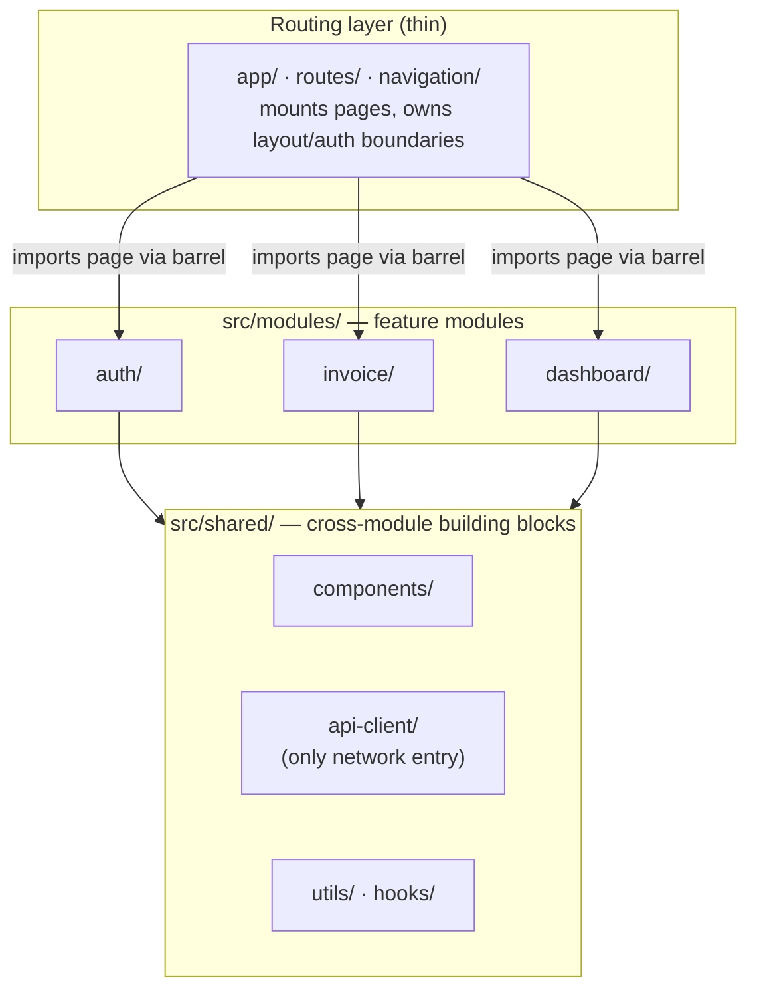
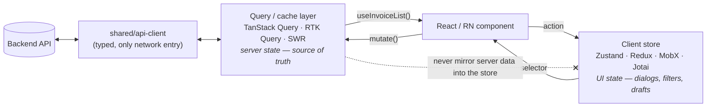
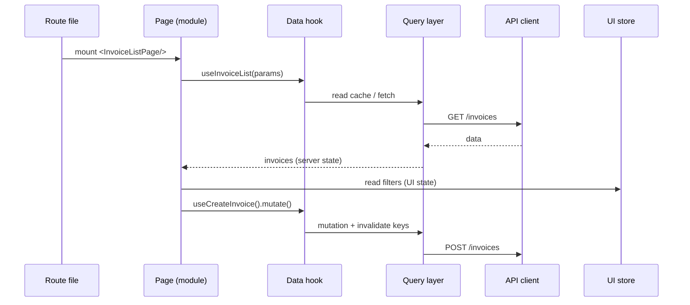

# Frontend Architecture Skill

A portable, **framework-agnostic** architecture style for any React or React Native frontend — packaged as an [Agent Skill](https://www.anthropic.com/news/skills) (`SKILL.md`) that Claude Code, Cursor, OpenCode, Codex, Windsurf, and other agents can read and apply.

It organizes apps into **feature modules** with **page/screen directories**, a strict **server-state vs UI-state split**, **barrel-only** cross-module imports, **co-located styles**, and clear **component-promotion** rules.

- ✅ **State-management agnostic** — Zustand, Redux Toolkit, MobX, Jotai, Valtio, or Context.
- ✅ **Styling agnostic** — Tailwind, CSS Modules, Tamagui, React Native StyleSheet, styled-components.
- ✅ **Framework agnostic** — Next.js App Router, React + Vite, Remix, and Expo / React Native.
- ✅ **Naming conventions** — interfaces prefixed with `I` (e.g. `IFeatureUiState`).

> The skill describes a **structure and a set of rules**, not a component library or a visual design. Pair it with a design/component skill for the look-and-feel.

---

## Install

With the [`skills` CLI](https://skills.sh) (works across Claude Code, Cursor, Codex, and more):

```bash
# install just this skill
npx skills add stareezy-1/frontend-architecture-skill --skill "frontend-architecture"

# or install every skill in the repo
npx skills add stareezy-1/frontend-architecture-skill
```

`--skill` (short: `-s`) selects a single skill from the repo; omit it to add all skills. Add `-g` to install globally into `~/` instead of the current project.

Or copy it manually into your agent's skills directory:

```bash
# Claude Code (project scope)
mkdir -p .claude/skills && cp -r skills/frontend-architecture .claude/skills/

# Cursor / others that read .ai/skills
mkdir -p .ai/skills && cp -r skills/frontend-architecture .ai/skills/
```

> Note: `gh skill install` is a preview feature of the GitHub CLI and is not yet available in stable `gh` releases. Use the `npx skills` command above (or manual copy) until it ships.

---

## The architecture at a glance

The whole model is five rules applied mechanically. The diagrams below show how they fit together.

### 1. Layered structure — routing is thin, modules hold the app

A route file does almost nothing: it imports a page component from a module barrel and mounts it. All real work lives inside feature modules, which lean on a shared layer.



### 2. Inside a module — the barrel is the only public door

Everything inside a module is private except what its `index.ts` re-exports. Other modules and the router may import **only** from `@/modules/{feature}` — never a deep internal path.

```mermaid
graph TD
    Outside["Other modules / routing layer"] -->|"@/modules/invoice"| Barrel

    subgraph ModuleInvoice["modules/invoice/"]
        Barrel["index.ts<br/>PUBLIC BARREL (the contract)"]
        Pages["pages/&#123;page&#125;/<br/>page.tsx + page.styles.ts + components/ + hooks/"]
        Components["components/<br/>reused by 2+ pages in this module"]
        Hooks["hooks/<br/>query/mutation + key factory"]
        Stores["stores/<br/>UI state only"]
        Services["services/<br/>data access"]
        Types["types/"]

        Barrel --- Pages
        Barrel --- Components
        Barrel --- Hooks
        Barrel --- Stores
        Barrel --- Types
        Pages --> Components
        Pages --> Hooks
        Pages --> Stores
        Hooks --> Services
    end
```



### 3. State is split by origin — and never crosses over

Server data lives in the query/cache layer; UI data lives in the client store. Components read from both but write through hooks — they never `fetch()` directly, and server entities are never copied into the store.



### 4. Component promotion — start local, move outward only when reused

A component is born in the narrowest scope and is promoted one level only when a **second** consumer appears. The same ladder applies to hooks, utils, and constants.

```mermaid
graph LR
    A["Used by ONE page<br/>pages/&#123;page&#125;/components/"]
    B["Used by 2+ pages in a module<br/>modules/&#123;feature&#125;/components/"]
    C["Used by 2+ modules<br/>shared/components/"]
    D["Used by 2+ apps/repos<br/>published package"]

    A -->|"2nd consumer in module"| B
    B -->|"2nd consuming module"| C
    C -->|"2nd consuming app"| D
```



### 5. How a request flows through the layers

Putting it together: a route mounts a page, the page reads server state via a hook and UI state via a selector, mutations go back through the query layer to the API, and styling is referenced from a co-located file.



---

## What's inside

```
skills/
└── frontend-architecture/
    └── SKILL.md     ← the skill (frontmatter + instructions)
```

The skill covers:

1. **Five core ideas** — feature modules, page directories, state-by-origin, barrel imports, promotion.
2. **Directory layout** — identical across frameworks.
3. **Feature modules** — the barrel as a contract.
4. **State split** — server (query layer) vs UI (client store), with examples for Zustand / Redux Toolkit / MobX / Jotai.
5. **Co-located styling** — Tailwind / CSS Modules / Tamagui / StyleSheet.
6. **Naming conventions** — `I`-prefixed interfaces and more.
7. **Framework adapters** — Next.js, Vite SPA, Remix, Expo / React Native.
8. **Review checklist** + **component promotion ladder**.

---

## When the agent should use it

- Scaffolding a new app.
- Adding a feature or module.
- Deciding where a component, hook, or piece of state belongs.
- Naming types and interfaces.
- Reviewing folder structure and import boundaries.

---

## License

[MIT](./LICENSE) — use, copy, and adapt freely.
